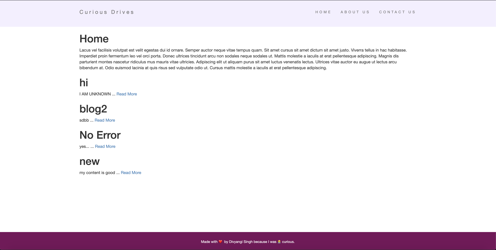
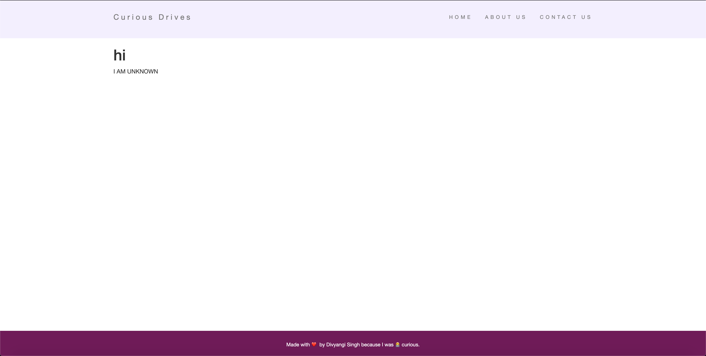
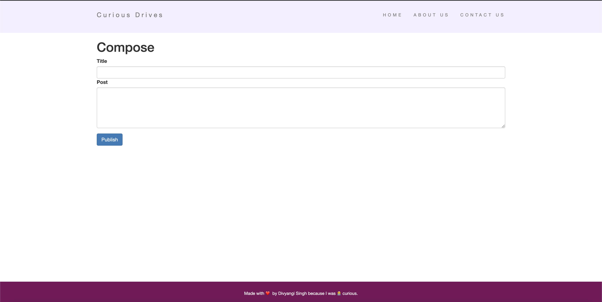
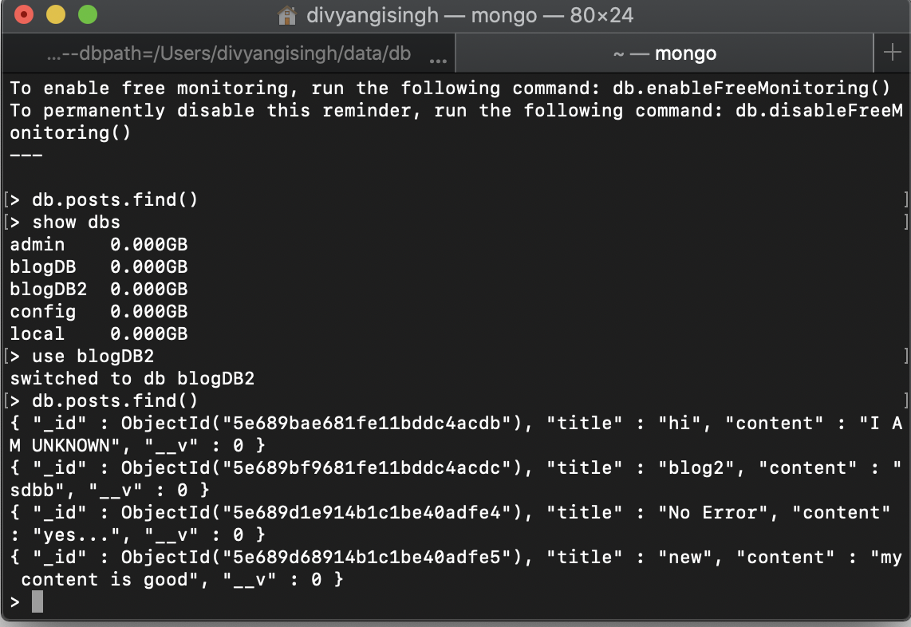

# CuriousDrivesBlog
<h1>My personal Blog website<h1>
   
<li>Home Page with blog display</li>
   

    
<li>Individual Blog Page</li>
    

    
<li>Blog Compose Page</li>
    

    
<li>Data getting stored in mongodb</li>
    

    
 
<h2>Stack Used</h2>
Front End: <b>HTML, CSS, EJS</b>
 
Logic Layer:<b> Node.js, Express</b>
 
Backend: <b>MongoDB</b>

<h2>Functionality:</h2>
<li>To compose blog post.</li>
<li>To save blog post in mongoDB database.</li>
<li>To retrive blog and display on the web page.</li>
<li>To direct individual block post to a fresh page for accessing full blog.</li>
